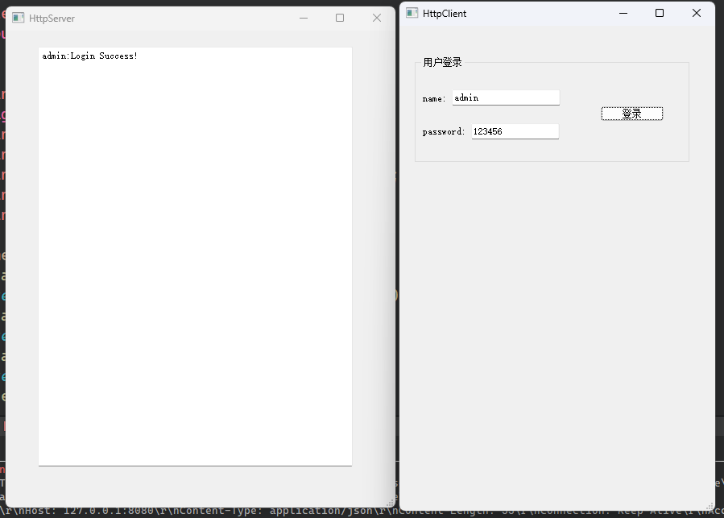

# Qt_HTTP_Server_Client
使用Qt实现HTTP服务器，客户端demo；实现文件的上传和下载

## 核心类

### QNetworkAccessManager

简介：Qt中网络请求的调度中心，管理应用程序与远程服务器之间的所有网络通信。

#### 核心功能
1. 网络请求的发送与相应管理
   - 支持多种HTTP方法：包括GET、POST、PUT、DELETE、HEAD等，并能通过sendCustomRequest()发送自定义方法。
2. 封装请求与响应
   - 使用QNetworkRequest()配置请求（URL、头部、SSL参数等）。
        ```cpp
        QUrl url("http://127.0.0.1:8080/login");
        QNetworkRequest request(url);
        ```
   - 通过QNetworkReply对象接收响应数据，并解析状态码、响应头、内容等。

### QNetworkRequest
QNetworkRequest类用于封装要QNetworkAccessManager 发送的请求。
QNetworkRequest 属于“网络访问 API”（Network Access API），负责存储通过网络发送请求所需的全部信息。它包含一个 URL 及可配置请求的辅助信息（如设置标头、传输参数等）。


## 遇到的问题

### 一、 客户端POST()请求，服务端收到的Json为空
#### 1. 打印出handleRequest函数中的request:

request "POST /login HTTP/1.1\r\nHost: 127.0.0.1:8080\r\nContent-Type: application/json\r\nContent-Length: 54\r\nConnection: Keep-Alive\r\nAccept-Encoding: gzip, deflate\r\nAccept-Language: zh-CN,en,*\r\nUser-Agent: Mozilla/5.0\r\n\r\n"

request "{\n    \"password\": \"123456\",\n    \"username\": \"admin\"\n}\n"
发现一次请求两次request:
- 第一次仅收到请求头
- 第二次仅收到JSON请求体
证明请求头与请求体被拆分为两次TCP包到达。

#### 2. 问题所在：
```cpp
QString request = socket->readAll(); 
```
- readAll()一次性读取当前缓冲区所有数据，但首次调用时缓冲区可能只有请求头（尚未收到JSON体）
- 后续调用handleLogin时，用split("\r\n\r\n").last()提取请求体，此时请求体尚未到达，导致提取失败。

#### 3.​按Content-Length动态等待数据

```cpp
void handleRequest(QTcpSocket *socket) {
    // 1. 读取请求头（直到空行 \r\n\r\n）
    QByteArray headerData;
    while (socket->canReadLine()) {
        QByteArray line = socket->readLine();
        headerData += line;
        if (line == "\r\n") break; // 空行标志头结束
    }
    
    // 2. 解析Content-Length
    int contentLength = -1;
    foreach (const QByteArray &line, headerData.split('\n')) {
        if (line.startsWith("Content-Length:")) {
            contentLength = line.split(':')[1].trimmed().toInt();
            break;
        }
    }

    // 3. 按长度读取请求体（解决拆包问题）
    QByteArray body;
    if (contentLength > 0) {
        while (socket->bytesAvailable() < contentLength) {
            socket->waitForReadyRead(500); // 阻塞等待剩余数据
        }
        body = socket->read(contentLength);
    }

    // 4. 组合完整请求
    QByteArray fullRequest = headerData + body;
    qDebug() << "Full request:" << fullRequest;

    // 5. 后续路由逻辑（使用fullRequest替代原request）
    // ... [原路由代码，改用fullRequest解析]
}
```

